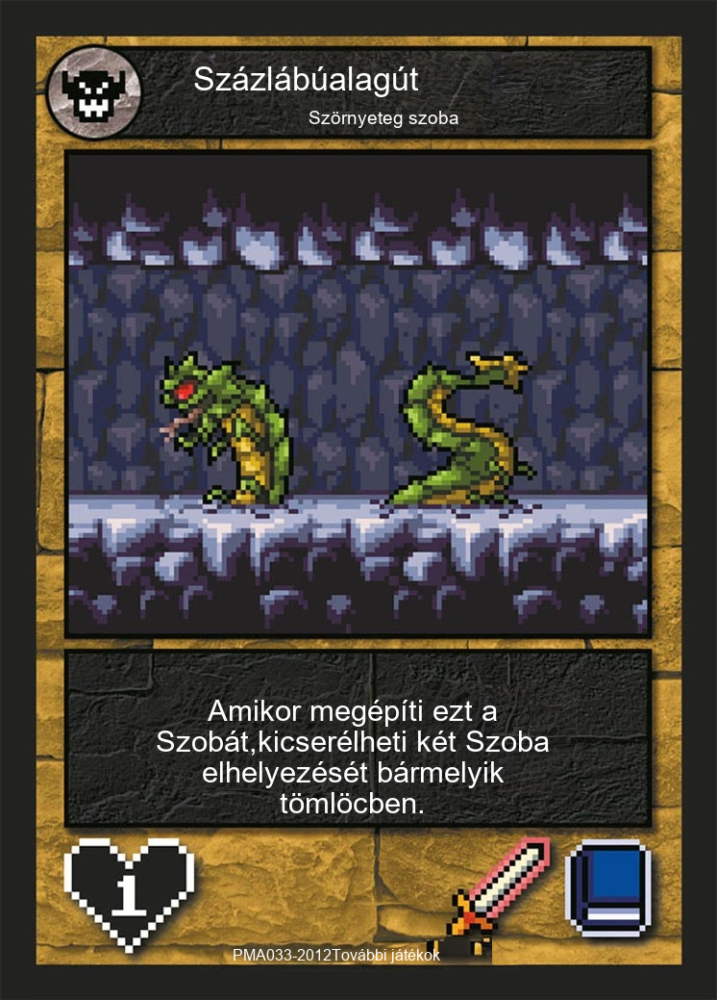

# InpaintTranslate

## What is this?

**TL;DR**: A Python script to translate text in images with inpainting by your favorite generative AI models (Stable Diffusion, Midjourney, DALL·E).

| Before                      | After (hungarian translation)                                 |
|-----------------------------|----------------------------------------|
|  |  |

## Under the hood

`InpaintTranslate` runs text detection on your image, masks the text boxes, and in-paints the masked regions
until your image is text-free.

`InpaintTranslate` can be run entirely on your local machine using

* [Tesseract](https://github.com/tesseract-ocr/tesseract) or [PaddleOCR](https://github.com/PaddlePaddle/PaddleOCR) for text detection and
* [Stable Diffusion](https://huggingface.co/stabilityai/stable-diffusion-2-inpainting) for in-painting

or can call existing APIs

* [Azure](https://azure.microsoft.com/en-us/products/cognitive-services/computer-vision/) for text detection and
* [OpenAI](https://openai.com/dall-e-2/) or [Replicate](https://replicate.com/) for in-painting.

## Usage

You can translate text from your image in just a few lines:

```python
from inpaint_translate.text_detector import PaddleTextDetector
from inpaint_translate.inpainter import LocalSDInpainter
from inpaint_translate.inpaint_translator import InpaintTranslator

text_detector = PaddleTextDetector()
inpainter = LocalSDInpainter()
translator = MyMemoryTranslator(source="en-US", target="hu-HU")

inpaint_translator = InpaintTranslator(text_detector, inpainter, translator)
inpaint_translator.inpaint_translate("/my/input/image/path.png", "/my/output/image/path.png")
```

or throught the handy `run.py` script

```commandline
python run.py "/my/input/image/path.png" -o "/my/output/image/path.png"
```

> Use verbose mode to create intermediary images in a "debug" folder by `-v` flag in `run.py` or by `logging` library logger set to debug mode.

We provide multiple implementations for text detection and in-painting (both local and API-based), and you are also free to add your own.

### Text Detectors

1. `TesseractTextDetector` (based on [Tesseract](https://github.com/tesseract-ocr/tesseract)) runs locally.
Follow [this guide](https://tesseract-ocr.github.io/tessdoc/Installation.html) to install the `tesseract` library locally. On Ubuntu:

```commandline
sudo apt install tesseract-ocr
sudo apt install libtesseract-dev
```

To find the path where it was installed (and pass it to the `TesseractTextDetector` constructor):

```commandline
whereis tesseract
```

1. `AzureTextDetector` calls a computer vision API from Microsoft Azure. You will first need to create a
[Computer Vision resource](https://portal.azure.com/#create/Microsoft.CognitiveServicesComputerVision) via the Azure
portal. Once created, take note of the endpoint and the key.

```python
AZURE_CV_ENDPOINT = "https://your-endpoint.cognitiveservices.azure.com"
AZURE_CV_KEY = "your-azure-key"
text_detector = AzureTextDetector(AZURE_CV_ENDPOINT, AZURE_CV_KEY)
```

Our evaluation shows that the two text detectors produce comparable results.

1. `PaddleTextDetector`(based on [PaddleOCR](https://github.com/PaddlePaddle/PaddleOCR)) runs locally.
Follow [this guide](https://github.com/PaddlePaddle/PaddleOCR/blob/main/docs/quick_start.en.md) to install the `paddlepaddle` library locally.
Or just use

```commandline
pip install -r requirements_paddleocr.txt
```

### In-painters

1. `LocalSDInpainter` (implemented via Huggingface's `diffusers` library) runs locally and requires a GPU. Defaults to
[Stable Diffusion v2 for in-painting](https://huggingface.co/stabilityai/stable-diffusion-2-inpainting).
2. `ReplicateSDInpainter` calls the [Replicate](https://replicate.com) API. Defaults to Stable Diffusion v2 for
in-painting (and requires an API key).
3. `DalleInpainter` calls the [DALL·E 2](https://labs.openai.com) API from OpenAI (and requires an API key).

```python
# You only need to instantiate one of the following:
local_inpainter = LocalSDInpainter()
replicate_inpainter = ReplicateSDInpainter("your-replicate-key")
dalle_inpainter = DalleInpainter("your-openai-key")
```

### Translator

Translations are provided with [deep-translator](https://github.com/nidhaloff/deep-translator).
> Keep in mind that different providers have different supported languages and restrictions on usage

## Authors

This project was based on [detexify](https://github.com/iuliaturc/detextify) by [Mihail Eric](https://twitter.com/mihail_eric) and [Julia Turc](https://twitter.com/juliarturc).

Created by [Dolers](https://github.com/Dolers) for his own amusement.
